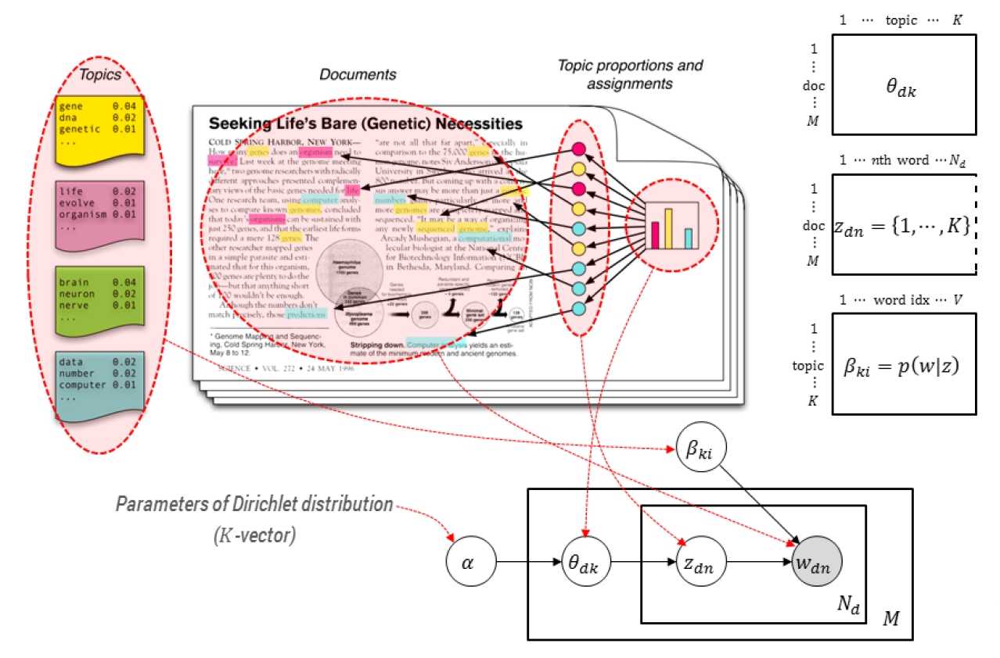
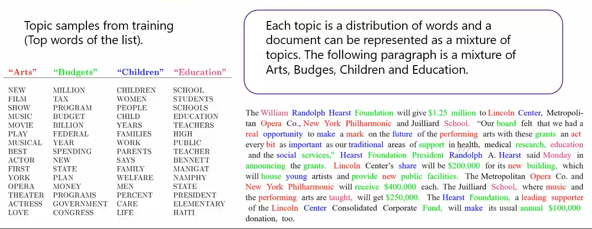
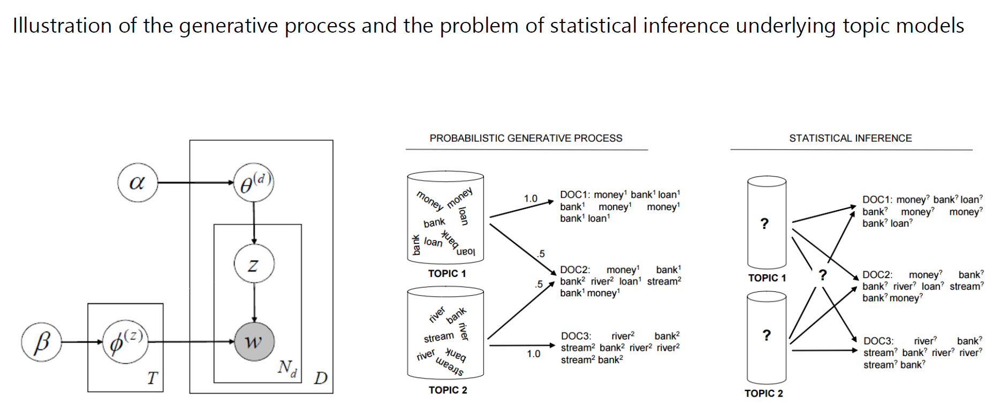
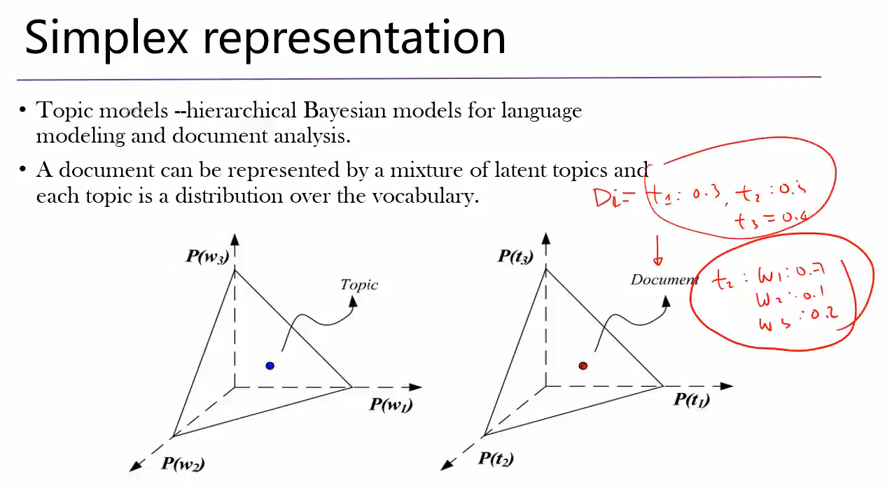
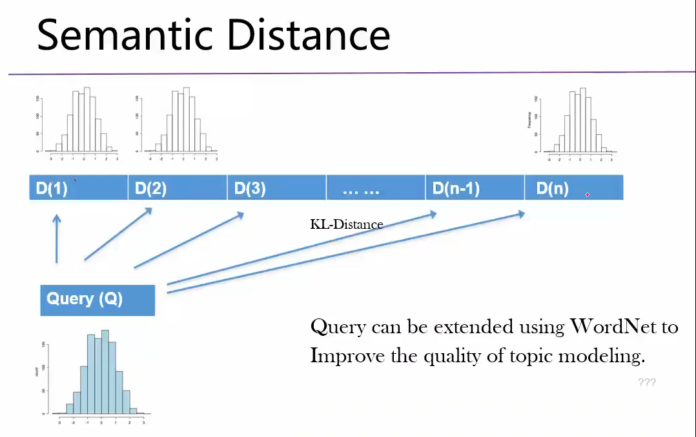

# LSA与语义空间
## LSA (Latent Semantic Analysis)
是一种对term-document矩阵(词频矩阵或TF-IDF矩阵)做Truncated SVD降维的操作，可以理解为将高维稀疏的term-document矩阵映射到低维稠密的空间。
## 语义空间
在这个低维稠密空间中，向量之间的不同距离能够代表语义之间的差异，所以这个低维稠密的空间也被称作语义空间(Semantic Space)。
# 一些理解关于LDA (Latent Dirichlet Allocation)
## Bayesian Model
在模型中，若x由θ决定，θ则为x的参数，表示为P(x|θ)。在正常情况下，θ为一个数值；而在贝叶斯模型中，θ是一个随机变量。
## Hierarchical Bayesian Model
接着Bayesian Model说，当贝叶斯模型中的参数θ是一个随机变量的时候，这个随机变量可能是由参数z控制的，表示为P(θ|z)。此时，z是θ的直接参数，z是x的超参数。当然，z也有可能是由参数α控制的，即P(z|α)，那么α就是z的直接参数，是整个模型的超参数。如此一层一层……
## Dirichlet Distribution
* 关于$\Gamma$函数：关于自变量x的阶乘在实数集上的延拓。
* 关于Dirichlet分布的性质：从Dirichlet分布中抽样出一个x，x各个维度相加等于1。
## LDA
* LDA是一个3层的Hierarchical Bayesian Model，也可以说是一个Hierarchical Generative Statistical Model。
* 可以想象，最外层有一个Dirichlet分布，参数是K维的α。
* θ服从这个参数为α的Dirichlet分布，是一个由当前分布生成的K维向量，且向量的每一个分量加和等于1。所以θ也可以被看做是一个概率分布(话题分布)。
* z服从θ的概率分布，z可以看做是从θ话题分布中抽样出来的一个离散变量(话题)。
* 在话题z中，w(词)也服从某种基于z(话题)和β(词的系数)的分布，所以可以将w(词)看做是从z(话题)中抽样出来的。
## LDA中的三个矩阵
下图中，包含三个矩阵：θ、z、β。
* 矩阵θ：表示每一个文档（行）对应的话题分布，每一列对应话题分布的一个分量。矩阵中第d行第k列的元素，代表话题k在文档d中的概率。话题分布（每一行）的所有分量（所有列）加和等于1。
* 矩阵z：表示每一个文档（行）的每一个词（列）来自于哪个话题（1-K）。
* 矩阵β：表示每一个话题（行，1-K）中，每一个词（列，1-V）出现的概率是多少。

可以得出，LDA是一个包含两个隐含变量（θ和z）的三层贝叶斯模型。
1. w~P(z, β)：w（词）由z（话题）和β（w在z中的概率）的联合概率分布生成；
2. z~P(θ)：z（话题）由θ（话题分布）的概率分布生成；
3. θ~Dirichlet(α)：θ（话题分布）的概率分布，由Dirichlet分布中的参数α控制。

## LDA提取到的主题和聚类的关系
### 主题不是模型学习出的标签
下图中可以看到，给定一段文本，利用模型可以从中找到很多Topic，这些Topic每一个都是词的概率分布，并不是严格意义的类标签。进一步讲，这些Topic，是对于经常共现且有相近含义或属于相同领域的词，人（注意是人，而不是模型）为去命名或指定这些词属于某个Topic，不是模型学习出来的某种能够表示词与词之间关系的标签。
### 主题和聚类的相似处
这里对主题的提取，看上去有点像聚类。对于聚类，我们在复杂的文本空间中，可以找到很多个簇，这些簇就好似文本空间中的相互正交的基向量，而任何文本都可以表示成为这些基向量（簇，暂时也可以理解为Topic）的线性组合。这相当于在词与文本之间找到了一个Middle-Level Feature（Topic，即这些词经常一起出现的聚类的形式）。
### 主题和聚类的差异
主题的提取又不等同于聚类，因为主题是一个概率分布。在聚类时，你可以说一个词属于某一个集合或者不属于某一个集合。而对于话题，我们不能说一个词属于（也可说来自于）某一个话题或者不属于某一个话题。因为任何词都可能属于（来自于）任何话题，任何话题也都有可能出现任何词，只不过是概率不一样而已。例如对于词table，在有关furniture的Topic中，出现的概率就会很高；在Computer的Topic中，概率就会比较低；在Religion的Topic中，概率可能几乎为0。

# 当下的Topic Model——话题模型（对于LDA的扩展）
* 如下图可以看到，当下的Topic Model已经有两个超参数α和β。α和之前一样，β则变了。
* LDA中，β是一个系数矩阵，控制给定Topic中，w（词）出现的概率。
* 而现在，β是用来控制上层Dirichlet分布（对，又多出来一个Dirichlet分布）的参数（和之前α的作用一样，相当于和α对称了）
* 通过这个新的Dirichlet分布，采样出来个φ。此处的参数φ，决定的是给定Topic时，w（词）的概率。
* 只不过方式变了，φ不是之前β那样的系数矩阵，而是一个概率分布，即给定Topic时，w（词）的概率分布。
* 如此的模型架构设计，从数学的角度上来说，更加完整/完善/完美。
## 总结
* 当下Topic Model包含两个Dirichlet分布；
* 话题分布θ~Dirichlet(α)；
* 给定话题后的词分布φ~Dirichlet(β)；
* 话题z~P(θ)；
* 词w~P(z, φ)。

## Simplex Representation
可以通过下图以几何的方式的辅助理解。
* 如下图左侧坐标系，Topic可以看做是w（词）的分布，此处假设有3个词，实际情况应该是几万个词。超空间中的一个点，代表一个Topic，每一个Topic对应的词的概率分布不同，各个分量（词的概率）相加等于1。
* 下图右侧的坐标系，Document（文档）可以看做是Topic的分布，解释同理。

## 可能的应用
如下图。与“Word2Vec将词映射为向量，并能保留一定的词与词之间的语义关系”相对应，Topic Model可以将文本映射为低维Topic空间的向量（Topic的离散分布），可以用（KL-Divergence）来做文本之间的匹配查询。

