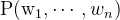
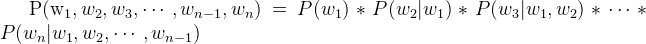
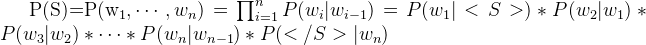
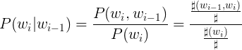
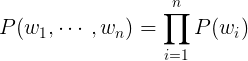
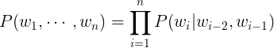

# 语言模型
* Language model originates from speech recognition.
* The basic concept of language model is about the probability of a sequence of words.  
* Infinite Monkey Theorem  
理解：给定一个词序列（句子/N元组/context），语言模型就是关于此词序列出现在所有可能N维元组（自然语言）中的频率（是自然语言的概率）。并且所有可能的N元组出现的概率之和为1。

例如求一句话S的概率  
_joint_probability.png)  
 
联合概率无法直接获得，所以用乘法公式将其展开，得：  
  
 
从.png)往后看，每一个条件概率依然不容易计算；且对于每一个词，都需要计算基于这个词前文所有词的条件概率这件事也不符合实际情况。所以进一步对模型进行简化，引入马尔科夫假设。  
马尔科夫假设是指在一个随机过程中，每一个时刻当前的状态，仅由这个状态的前N个状态来决定，或者说只受前N个状态的影响。如果N=1，那么就是一阶马尔科夫假设。  
 将马尔科夫假设应用于语言模型——此处引入最简单的一阶马尔科夫假设，即当前词出现的概率只与他前一个词是什么有关，这就得到了简化后的语言模型——二元语言模型Bigram：  
  
 根据条件概率公式可得：  
  
此处，.png)代表wi-1和wi这两个词在语料库中相邻出现的次数，#wi代表wi在语料库中出现的次数，#代表语料库的大小（词总个数）。如此，就可以计算一个句子的概率了。  
 除此之外，常见的还有一元语言模型Unigram————每一个词出现的概率只与这个词本身有关；三元语言模型Trigram————每一个词出现的概率与这个词前两个词有关。
